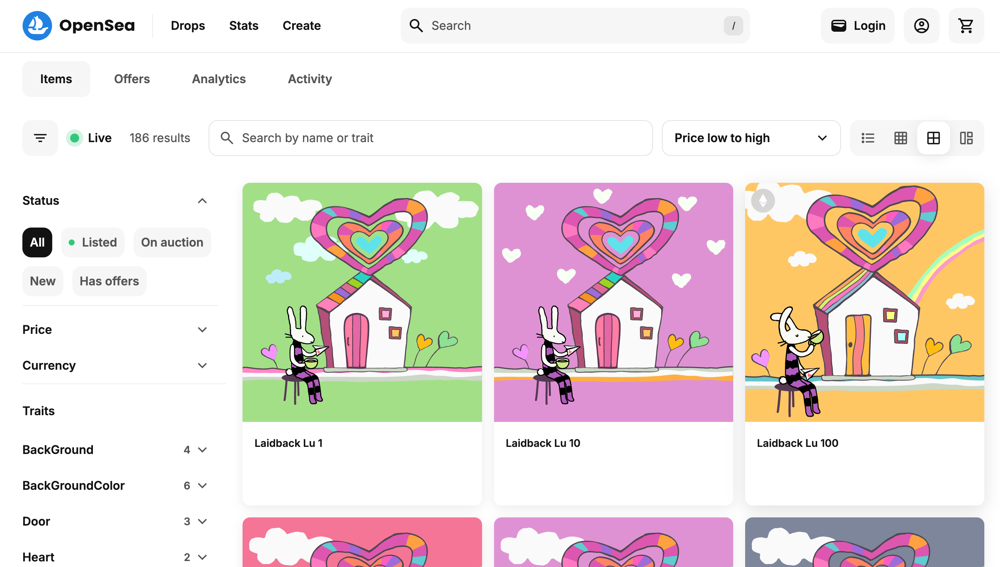
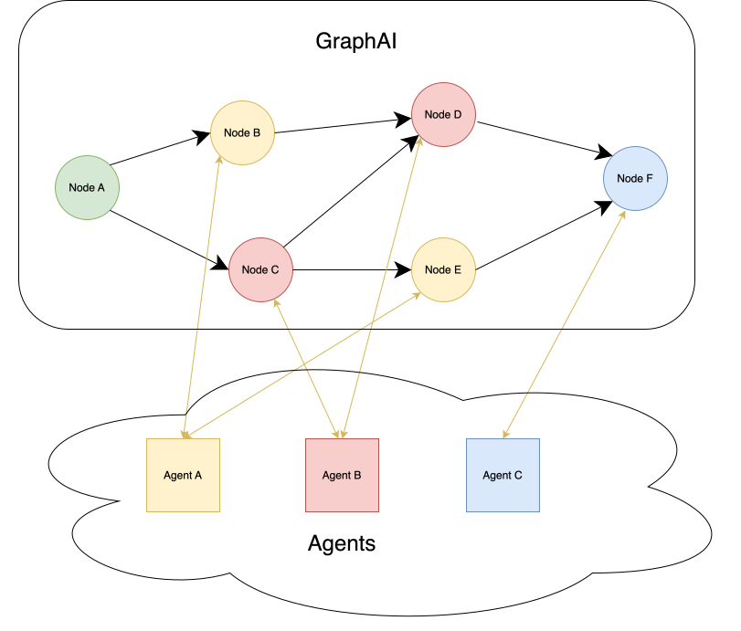
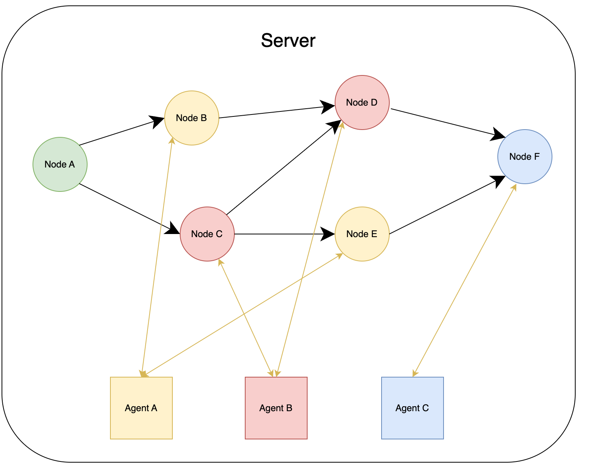
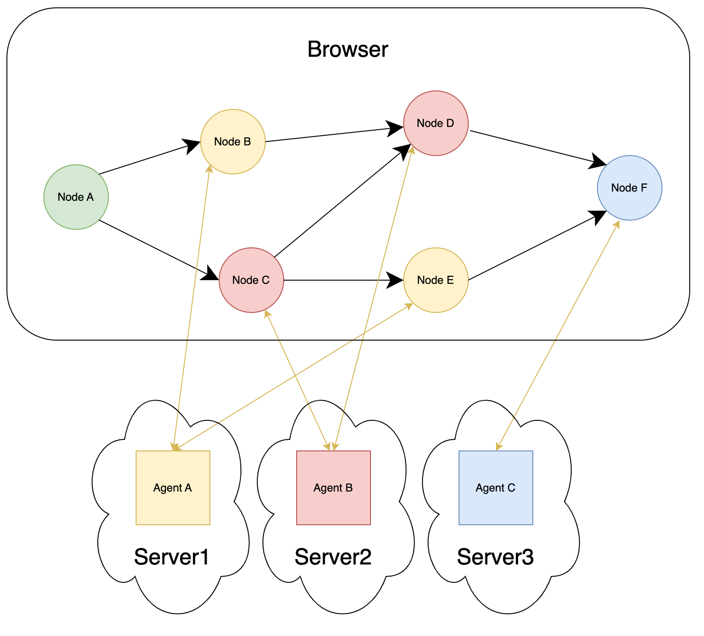
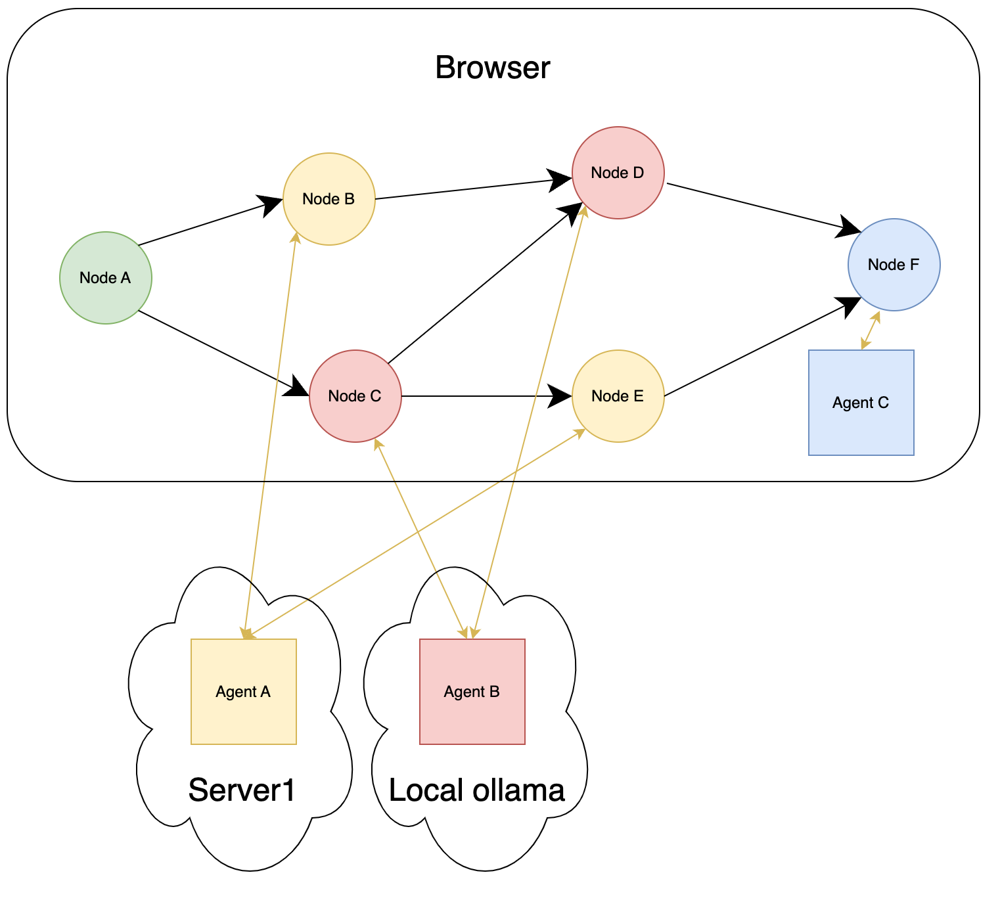
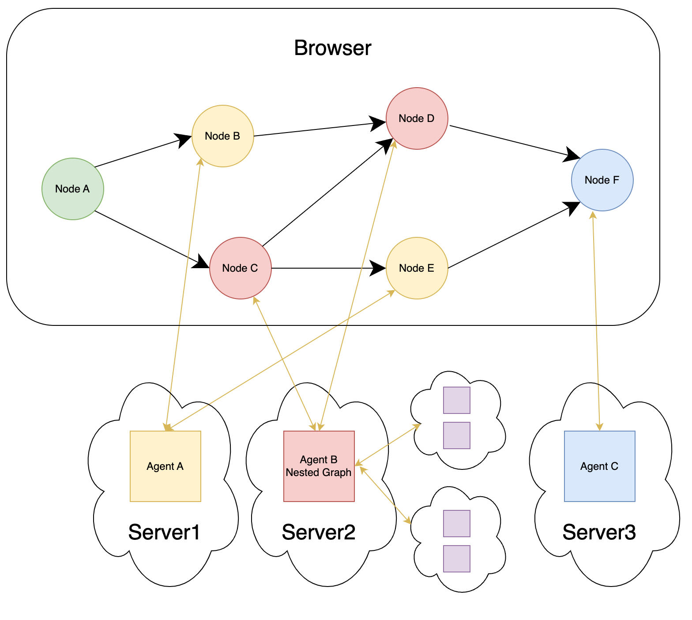
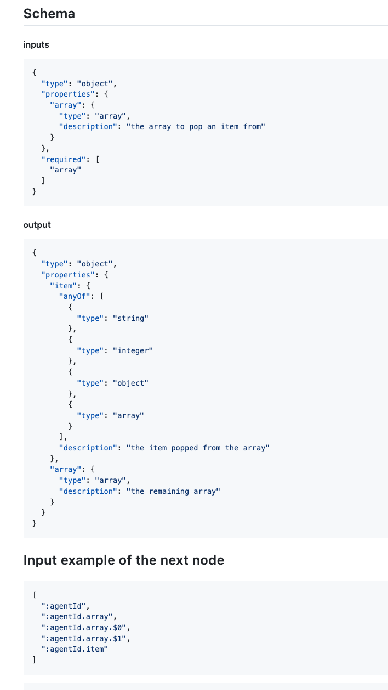
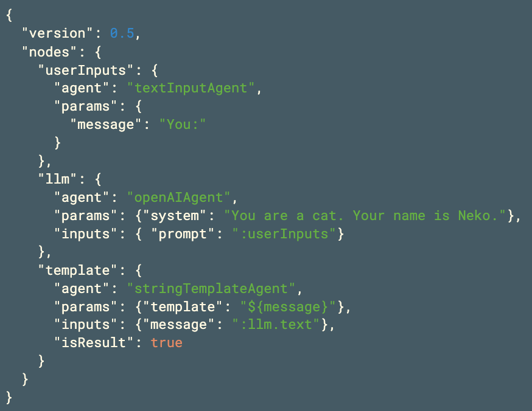

# GraphAI

## Full-Stack TypeScript Tool for AI Applications

Isamu Arimoto
<!--
_class: lead
_paginate: false
_header: ""

-->

---
 ## 自己紹介

- Isamu Arimoto
  - Software engineer
    - Server/Web
- Singularity Society
  - Fully-On-Chain
    - SVG 2 NFT
    - https://opensea.io/collection/laidback-lu
  - [おもちかえり.com](https://omochikaeri.com)
  - bus2.0
  - SlashGPT/GraphAI


  
---
 ## Contents
 - 内容
   - GraphAI 特徴 as Full-Stack TypeScript AI
   - GraphAIを試す方法
   - ツールや各種情報
   - GraphAIの未来
   
 - 発表しないこと
   - Agentの作り方
   - GraphDataの作り方
   - マルチエージェントの作り方

---
## GraphAI 特徴
 - 背景
   - 非同期処理
   - ML,LLMはPythonに任せてAPI経由で！
   - 全部TypeScriptで書きたい
   - FullStack TypeScript AI!!
 - TypeScript
   - Write once run anywhere
   - ブラウザ、サーバ、バッチ、cli

---
## GraphAI とAgent

|Graph | GraphとAgent|
|--|--|
| | 

 - GraphAI本体はシンプル
   - Graphの制御のみ
 - Agent - LLM/WebAPI/データ処理/IO
   - Agent Filter - 各Agentを実行する前後に処理を挟む
---
## GraphAI 特徴


- GraphAIからAgentの呼び出し
  - jsのAPIで呼び出す
  - httpでサーバのAPIを呼び出す
- GraphData, Agentはサーバ/クライアントで同じコード
- 環境依存なもの
  - 秘匿API keyの必要な処理/CORS
  - DB / Pythonの処理
  - ユーザからの入力
- どのAgent/Nodeをどのサーバで動かすか設定可能
  - 変更もすぐにできる
- express + middleware(@receptron/graphai_express)

---

## GraphAI を動かす構成 *
|Server / Batch / Browser | Server Client|
|--|--|
| <br/> Agentの呼び出しはjsのapi|  <br/> Agentをhttpで呼び出す|

---
## GraphAI を動かす構成
|Server分散| Server Local混在|
|--|--|
| | |

---
## GraphAI を動かす構成
|内外Server| サブグラフ|
|--|--|
| | |

---
## GraphAI 特徴

 - AgentはjsのapiでもhttpでもOK
   - 渡すデータは共通
 - httpであればAgentはTypeScriptでなくても良い。
   - サーバでPython/Go/Rust/RubyのAgent
   - jsでmock agentを作っておくと便利
 - Streamingもサポート
   - どの構成でも、ほとんど同じように動く
     - cli/ブラウザ
 - 環境に合わせて柔軟な組み合わせが可能
   - 開発、ブラウザで動作、サーバクライアントで動作をシームレス

---

## GraphAI 特徴

- JS API
```TypeScript
export const arrayJoinAgent = async ({ namedInputs, params }) => {
  const { separator } = params;
  return { text :namedInputs.array.join(separator ?? "") };
};
```
- HTTP
``` json
  Request body
   { namedInput: {array: ["1", "2", "3"]}, params: { separator: "-" }}
  Response
   { text: "1-2-3" }
```
---


### さて、どうやって試す？

- codePen/html
  - 11/14から対応中。ちょっと動く。jsdelivrでumd配布
    - https://codepen.io/isamua/pen/YzmgRYg
  - html
    - https://github.com/receptron/graphai/tree/main/packages/samples/htmlSample
    - openAIFetchAgent
- cli
  - npm package + sample graph file
- web
  - Vue.js での実装サンプル
- TypeScript
  - GraphAIレポジトリのtest/sample
  - zennの記事

---
### Agent *

- npmで提供
- llmAgent
  - openaiAgent / groqAgent / anthropicAgent / geminiAgent
- arrayAgent
  - pop / push / shift / join / flat
- dataAgent
  - copy / merge / sum / propertyFilter / total
- graphAgent
  - nestedAgent
  - mapAgent


---

### CLIで動かす

- CLIでコマンドとして
   - Agentは全部入り
   - GraphDataはYAML/JSONのファイルを渡す

- install
```
npm install -g @receptron/graphai_cli
```
- GraphDataのサンプル(yaml, json)をダウンロード
  https://github.com/receptron/graphai/tree/main/packages/samples/graph_data
- .env
  - OPENAI_API_KEY=sk-xxx
- run
```    
graphai ${file.yaml/json}
```

---
### CLIで動かす
```
graphai <yaml_or_json_file>

run GraphAI with GraphAI file.

Positionals:
      --yaml_or_json_file  yaml or json file                            [文字列]

オプション:
      --help     ヘルプを表示                                             [真偽]
      --version  バージョンを表示                                         [真偽]
  -l, --list     agents list
  -s, --sample   agent sample data                                      [文字列]
  -d, --detail   agent detail                                           [文字列]
  -v, --verbose  verbose log                   [真偽] [必須] [デフォルト: false]
  -a, --all      all result                    [真偽] [必須] [デフォルト: false]
  -m, --mermaid  mermaid                       [真偽] [必須] [デフォルト: false]
      --yaml     dump yaml                     [真偽] [必須] [デフォルト: false]
      --json     dump json                     [真偽] [必須] [デフォルト: false]
      --log      output log                                             [文字列]
```
---

## Sampleの紹介

https://github.com/receptron/graphai/tree/main/packages/samples/graph_data/openai

- business_idea_jp.yaml
  - 事業アイデアを出して評価(map)
- chat.yaml
  - シンプルなAIとのチャット(loop)
- interview.yaml
  - 指定した有名人にインタビュー(history)
- reception.yaml
  - 氏名、生年月日、性別を尋ねる(tools)
- metachat.yaml
  - reception.yamlを元にGraphData生成(interpreter)
- weather.yaml
  - APIを使って天気を調べる(nested graph)


---
### TypeScriptでの動かし方  *
必要なパッケージのインストール
```zsh
yarn add graphai
yarn add @graphai/agents  
```
コード
```TypeScript
import { GraphAI } from "graphai";
import * as agent from "@graphai/agents";                                                                                      

const graphData = {...};
const main = async () => {
  const graphai = new GraphAI(graphData, agents);
  const ret = await graphai.run();
  console.log(ret);
};
main();
```

---

### Web(vue)で動かす
  - https://github.com/receptron/graphai-demo-web/ (vue)
    - ほとんどのサンプルがvueのフロントだけで動く
  - https://github.com/receptron/graphai-agent-server (express)
    - サンプルサーバ


---

## Streamingの実装方法

### Agent

```typescript
  for await (const message of chatStream) {
    const token = message.choices[0].delta.content;
    if (filterParams && filterParams.streamTokenCallback && token) {
      filterParams.streamTokenCallback(token);
    }
  }
```

### Clent

```typescript
const outSideFunciton = (context: AgentFunctionContext, data: string) => {
  const nodeId = context.debugInfo.nodeId;
  streamData[nodeId] = (streamData[nodeId] || "") + data;
};
const agentFilters = [{
  name: "streamAgentFilter",
  agent: streamAgentFilterGenerator<string>(outSideFunciton),
}];
```

---

## npm *
- graphai 本体
- @graphai/*_agents
  - 単機能のごとに１つのnpm=agent / 依存関係を減らす目的
  - @graphai/vanilla - npmの依存のないagent
  - @graphai/llm_agents - openAIAgent, groqAgentなどのメタパッケージ
  - @graphai/agents - 全部入りメタパッケージ
  - @graphai/agent_filters
- @receptron/* ツール郡
  - graphai_cli, graphai_express, 

---
## npm *

| 目的 | パッケージ|
|--| --|
| cli利用  | @receptron/graphai_cli|
| TypeScriptで動かす*1 |  graphai, @graphai/agents |
| TypeScriptでstreaming | *1 + @graphai/agent_filters |
| AgentServer(streaming) | @receptron/graphai_express,  @graphai/agents |

- @graphai/agentsは個別のagentでもOK
- AgentServerはGraphAI不要
  - ServerはAPIが一致していれば言語不問
  - inputs/params/result

---
## gitの構成

- 本家レポジトリはモノレポ
  - https://github.com/receptron/graphai
  - packages
    - GraphAI本体/サンプル/各種ツール/document generator/ agent filter
  - agent
    - 各種Agent
  - llm_agents
    - llmのagents
- yamlの純粋なサンプル
  - https://github.com/receptron/graphai_samples
- express/cytoscape
  - receptron/graphai-utils
----

## gitの構成
- Vueのデモ
  - https://github.com/receptron/graphai-demo-web
- PythonのAgentサーバサンプル
  - https://github.com/receptron/graphai-python-server
- Agent Server(sample)
  - https://github.com/receptron/graphai-agent-server
  - agents + expressの実装例
  

---

## Document

- 公式レポジトリのTOPからリンク
- zennでGraphAI
  - https://zenn.dev/topics/graphai?order=latest

---

## Express Server(API)
 - AgentFunctionInfoを元に、サーバが提供できるAPI一覧
 - 将来的に、これらの情報を使って、動的にAgentを利用できる仕組みを提供
 - メタAPI Info Server
 - Agent分散 + AIによるGraphDataの自動生成


---
## Future

- 世界中のAgentを使ったDynamic multi-agent

- 要素技術
  - metachat.html - 動的にGraphDataを作る
  - agent server
  - agent のmetainfo + agent api
- 世界中のAgentのAPI List
  - Agentを検索する仕組み
  - Agentを探すAgent
- Web3 ??
  - Agentに対する報酬(課金)/信頼性の評価


---

## まとめ

 - GraphAIは、サーバ、クライアントの構成自由自在
 - いろいろな方法で試せる
 - 試して、フィードバックください


---

## Thank you!!


---


### Agent *
-  一覧
https://github.com/receptron/graphai/tree/main/docs/agentDocs
- llmAgent
  - openaiAgent / groqAgent / anthropicAgent / geminiAgent
- arrayAgent
  - pop / push/shift / join / flat
- dataAgent
  - copy / merge / sum /propertyFilter / total
- graphAgent


---

### graphAgent
 - nestedAgent
   - Agent内でGraphAIを実行
   - loopと組み合わせることで多様な処理
     - loop - Graph全体を繰り返す(n回 or 条件を満たすまで)
     - Chatでユーザからの入力が条件を満たすまで
       - Funciton callingの結果がとれるまで
     - Codeを実行するAgentと組み合わせて、正しい処理が終わるまで
 - mapAgent
   - 同じ処理に別々のデータを渡して並列。
   - アイデアを10個出す
   - それぞれのアイデアを評価

---
### GraphDataの作り方 *
 - 必要なAgentを探す
 - inputsでつなげる
 - 走らせる
   - 最初は全てnodeの結果を受け取る
   - `graphai.run(true)` 

```TypeScript
const main = async () => {
  const graphai = new GraphAI(graphData, agents);
  const logger = (log, __isUpdate) => { console.log(log)};
  graphai.onLogCallback = logger;
  const ret = await graphai.run(true);
  console.log(ret);
};
main();
```



---
### inputs *
 - 前のNodeの結果を受け取る
   - 依存/Agentに渡す値
   - Graphを作るときに一番ハマるポイント
 - inputs: `Record<string, unknown>`
 - `:nodeId.props.props.function().function()`
 - 前のNodeの結果＆Nodeの入力の形式
   結果: nodeA: `{ array: ["foo", "bar"]}`
   inputs: `{ text: ":nodeA.array.join() }`
 - arrayには`array.$0` `array.$1`

 - graph_agentには見えないStaticNodeがある
   - mapAgent rows -> row
   - nested inputsがstatic nodeに

---
### props function
 - inputsで使える関数
   - :node.array_data.length()

---

### Agentの作り方
  - agent/agentFunction/Sample & UnitTest
    - 関数を作る
    - AgentFunctionInfoでwrap
    - (tsの場合、agentに即時関数を渡す裏技もある)
      - agent: (namedInputs) => { console.log(namedInputs); return true;}
    - AgentFunctionInfoのsampleでunit test
  - Repositories
    - SampleのAgentを作る
      - https://github.com/isamu/graphai_agent_template
    - SampleのAgentを作る(モノレポ)
      - https://github.com/isamu/graphai-agents/tree/main/packages
    - テストランナー
      - https://github.com/isamu/graphai_agent_test_runner     
---
## AgentFunctionInfo
```TypeScript
// Params, result, input(array), namedInput(record)
export const dataSumTemplateAgent: AgentFunction<Record<never, never>, number, number> = async ({ inputs }) => {                                
  return inputs.reduce((tmp, input) => {
    return tmp + input;
  }, 0);
};
const dataSumTemplateAgentInfo: AgentFunctionInfo = {
  name: "dataSumTemplateAgent",
  agent: dataSumTemplateAgent,
  samples: [
    {
      inputs: [1, 2],
      params: {},
      result: 3,
    },
  ],
  description: "Returns the sum of input values",
  category: ["data"],
  author: "Satoshi Nakajima",
  repository: "https://github.com/receptron/graphai",
  license: "MIT",
};
export default dataSumTemplateAgentInfo;
```
- agentの本体と、agentに関する情報
- UnitTestの自動化/Documentの自動化/httpでのAPI Info


---

## ユーティリティ
- Agentテスト
  - AgentFunctionInfoを使ってUnit Test
    - TDD
  - Agentのdoc
    - documentの自動生成
  - express serverのmiddleware
    - すぐにサーバ、クライアント構成ができる
---


---
## AgentFilter
 - 各Agentを実行する前後に処理を挟む
   - expressのmiddleware, Railsのaround filter
   - agentId, nodeId単位で動作の有無を定義
 - 例
   - サーバへ処理をバイパス
   - キャッシュ
   - ログ
   - streaming


---


###  GraphData/Agentの説明 *
- Graph
  - Graph = Graph theoryのグラフ
  - NodeとEdge(inputs)で構成/有向非巡回グラフ
    - Graphの定義では非巡回だがLoop処理は可能(全体を繰り替えす)
    - NestedGraphで、局所的にLoopも可能
  - JSON/YAML/TypeScriptの構造化データ(GraphDataと呼びます)

  - 最初に入力がないNodeが実行される
  - そのNodeの動作が完了したら、そのNodeの結果を受け取る次のNodeが実行される

---

## GraphData * 
- llm/templateがNode
- inputsの:llmがEdge(SourceがllmでTargetがtemplate)
```json
{
  "version": 0.5,                                                                                                                        
  "nodes": {
    "userInputs": {
      "agent": "textInputAgent",
      "params": {
        "message": "You:"
      }
    },
    "llm": {
      "agent": "openAIAgent",
      "params": {"system": "You are a cat. Your name is Neko."},
      "inputs": { "prompt": ":userInputs"}
    },
    "template": {
      "agent": "stringTemplateAgent",
      "params": {"template": "${message}"},
      "inputs": {"message": ":llm.text"},
      "isResult": true
    }
  }
}
```

---

## GraphAIって？ *
 - GraphAI本体はNodeとInputsの管理とタスクの管理のみ
 - GraphAI本体自体はAgentは持っていない
   - コンストラクタにGraphDataと共に、agentsや、agent filterを渡す
   - GraphAI本体とは別にAgentを配布している
     - 単体パッケージ多数
   - Agentは必要なものだけ渡せる
   - 自作Agentと配布されているAgentを一緒に使える


---
### TypeScriptでの動かし方(サンプル) *

yarnのscript - https://github.com/receptron/graphai/tree/main/packages/samples
```
yarn run sample src/llm/interview_jp.ts
```

Web(vue) - https://github.com/receptron/graphai-demo-web/

```
yarn install
yarn serve
```

ai-scientist-ts  - https://github.com/isamu/ai-scientist


