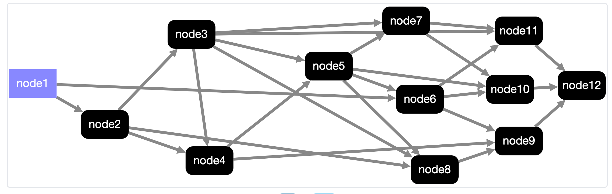

# GraphAI

Isamu Arimoto
<!--
_class: lead
_paginate: false
_header: ""
-->
---

###  GraphData/Agentの説明

- GraphData
  - Graph = Graph理論のグラフ
  - NodeとEdge(inputs)で構成/有向非巡回グラフ
  - JSON/YAML/tsなど構造化データ


---

## GraphData
```TypeScript
{
  version: 0.5
  graph: {
    llm: {
      agent: "openAIAgent"
      params: {system: "foo bar"}
    },
    template: {
      agent: "stringTemplate",
      inputs: {message: ":llm"}
    }
  }
}
```

---

- Agent
  - TypeScriptで書かれたプログラム
    - LLM
    - Fetch(http)
    - データ処理

```TypeScript
export const arrayJoinAgent: AgentFunction<{ separator?: string; flat?: number }, { text: string }, Array<never>, { array: Array<unknown> }> = async ({
  namedInputs,
  params,
}) => {
  assert(!!namedInputs, "arrayJoinAgent: namedInputs is UNDEFINED!");
  assert(!!namedInputs.array, "arrayJoinAgent: namedInputs.array is UNDEFINED!");

  const separator = params.separator ?? "";
  const { flat } = params;

  const text = flat ? namedInputs.array.flat(flat).join(separator) : namedInputs.array.join(separator);
  return { text };
};
```

---

### GraphAIを動かすには？
 - CLI
```bash
 $ graphai file.yaml
``` 
 - TypeScript
```TypeScript
  import { GraphAI } from "graphai";
  import * as agent from "@graphai/agentns";
  const graphai = new GraphAI(data, agents);
  await graphai.run()
```

---

### CLIの動かしかた説明
  - npm install -g @receptron/graphai_cli
  - GraphDataのサンプルをダウンロード
    例えば https://github.com/receptron/graphai/tree/main/packages/samples/graph_data
  - dot envを追加
    - .env
      - TODO
---
### TypeScriptでの動かし方説明
必要なパッケージのインストール
```sh
yarn add graphai
yarn add @graphai/agents  
```
コード
```
const main = () => {
  const graphai = new GraphAI(data, agents);
  await graphai.run();
};  
```
---


### 動作例
  


---

## GraphData
```TypeScript
{
  version: 0.5
  graph: {
    llm: {
      agent: "openAIAgent"
      params: {system: "foo bar"}
    },
    template: {
      agent: "stringTemplate",
      inputs: {message: ":llm"}
    }
  }
}
```

---
## Agent
```TypeScript
// Params, result, input(array), namedInput(record)
export const dataSumTemplateAgent: AgentFunction<Record<never, never>, number, number> = async ({ inputs }) => {
  return inputs.reduce((tmp, input) => {
    return tmp + input;
  }, 0);
};

const dataSumTemplateAgentInfo: AgentFunctionInfo = {
  name: "dataSumTemplateAgent",
  agent: dataSumTemplateAgent,
  samples: [
    {
      inputs: [1, 2],
      params: {},
      result: 3,
    },
  ],
  description: "Returns the sum of input values",
  category: ["data"],
  author: "Satoshi Nakajima",
  repository: "https://github.com/receptron/graphai",
  license: "MIT",
};
export default dataSumTemplateAgentInfo;


```
---

```TypeScript
import { GraphAI } from "graphai";
import * as agents from "@graphai/agents";

const graphData = {
 ...
};

const main = async () => {
  const graphai = new GraphAI(graphData, agents);
  const result = await graphai.run(true);
  console.log(result);
}

```

---

## npm
- graphai 本体
- @graphai/*_agents
  - 単機能のごとに１つのnpm=agent / 依存関係を減らす目的
  - @graphai/vanilla - npmの依存のないagent
  - @graphai/llm_agents - openAIAgent, groqAgentなどのメタパッケージ
  - @graphai/agents - 全部入りメタパッケージ
- @receptron/* ツール郡
  - graphai_cli, graphai_express, agent_filters

---

## 動作方法 1
 - クライアントのみで動く
   - ブラウザで動作
     - dangerouslyAllowBrowserでopenAIも利用可
     - ollama使って閉じた環境での利用
---

## 動作方法 2
 - サーバのみで動く
   - クライアントからGraphDataをpostする
   - サーバにGraphDataを含む処理を実装
     - 一般的なサーバシステム
 - cliツール
   - コマンドラインで graphai {json_file}
 - バッチ処理
 - Raycastなど、TypeScriptで動くツールに組み込む

---
## 動作方法 3
 - サーバとクライアント連携して動く
   - GraphDataはクライアントで実行
     - Agentは必要に応じでAgentごとにクライアント/サーバで実行
       - サーバで動かす必要のある処理だけサーバで動かす
         - API keyの秘匿性 / データベースへのアクセス / 書き込み
     - Agentがhttpのendpointと対応
---

## サーバクライアント方式
   - 処理の分散
     - サーバは複数サーバ対応
     - 混んでいるサーバを避ける
     - やすいサーバをDynamicに
   - サーバのAgentは必ずしもTypeScriptでなくても良い
     - WebAPIの仕様さえ同じならなんでもok
     - PythonのLLM
     - RAG

---
## AgentFilter
 - 各Agentを実行する前後に処理を挟む
   - expressのmiddleware, Railsのaround filter
   - agentId, nodeId単位で動作の有無を定義
 - 例
   - サーバへ処理をバイパス
   - キャッシュ
   - ログ
   - streaming
---

## Streaming
 - AgentFilterとAgent側の実装
 - httpのstreamingに対応可能
 - いずれの動作方法でも可能
 - 並列で動いている場合も対応

---

## AgentFunctionInfo
- agentの本体と、agentに関する情報
- GraphAIの動作のみならず、様々なツールで利用可能


---

## ユーティリティ
- Agentテスト
  - AgentFunctionInfoを使ってUnit Test
    - TDD
  - Agentのdoc
    - documentの自動生成
  - express serverのmiddleware
    - すぐにサーバ、クライアント構成
---

## Express Server(API)
 - AgentFunctionInfoを元にApiの情報


---

## Future

GraphDataを書き出すAI

- Agentを組み合わせたSubGraphのAgent化
- 世界中のAgentのAPI List
- Agentを検索する仕組み
- Agentを探すAgent
- Agent同士のプロトコルの標準化
- Agentに対する報酬の仕組み
- Agentの信頼性


---
memo

- Agent単体でテストができる（疎結合）
- データの情報をAgentが持つ
  - データ変換の仕組みを用意すれば自動的にagentを結び付けられる
    - Array to string
    - Object to array

---
特徴
 - write once run anywhere
   - ブラウザ、サーバ、組み込み、バッチ、cli
 - no depencendy
   - 本体などは依存するnpmはない
   - vanilla aggentも！
   - 依存があるパッケージは、それぞれ独立
 - 疎結合
   - agent単位でテストができる
 - テストやドキュメントの仕組みを内包する