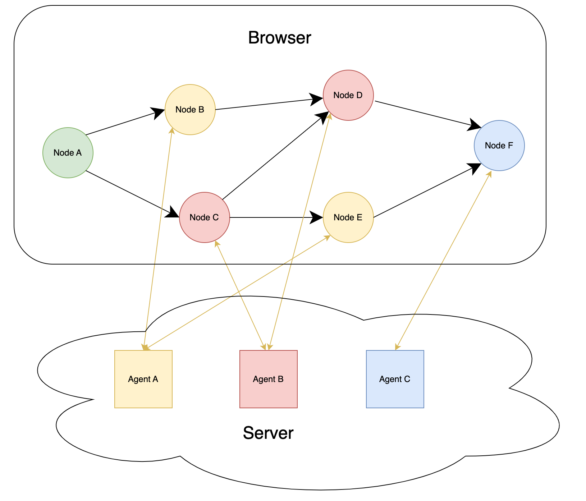

# GraphAI

Isamu Arimoto
<!--
_class: lead
_paginate: false
_header: ""

-->
---

###  GraphData/Agentの説明
- Graph
  - Graph = Graph theoryのグラフ
  - NodeとEdge(inputs)で構成/有向非巡回グラフ
    - Graphの定義では非巡回だがLoop処理は可能(全体を繰り替えす)
    - NestedGraphで、局所的にLoopも可能
  - JSON/YAML/TypeScriptの構造化データ(GraphDataと呼びます)

  - 最初に入力がないNodeが実行される
  - そのNodeの動作が完了したら、そのNodeの結果を受け取る次のNodeが実行される

---

## GraphData
- llm/templateがNode
- inputsの:llmがEdge(SourceがllmでTargetがtemplate)
```json
{
  "version": 0.5,                                                                                                                        
  "nodes": {
    "userInputs": {
      "agent": "textInputAgent",
      "params": {
        "message": "You:"
      }
    },
    "llm": {
      "agent": "openAIAgent",
      "params": {"system": "You are a cat. Your name is Neko."},
      "inputs": { "prompt": ":userInputs"}
    },
    "template": {
      "agent": "stringTemplateAgent",
      "params": {"template": "${message}"},
      "inputs": {"message": ":llm.text"},
      "isResult": true
    }
  }
}
```


---
## Agent
  - TypeScriptで書かれたプログラム
    - LLM
    - Fetch(http)
    - データ処理
    - AI/LLMでなくても良い
  - params, namedInputsを受け取ってresultを返す
  - KISS (Keep it simple stupid.)
```TypeScript
export const arrayJoinAgent: AgentFunction<{ separator?: string; flat?: number }, { text: string }, Array<never>, { array: Array<unknown> }> = async ({
  namedInputs,
  params,
}) => {
  assert(!!namedInputs, "arrayJoinAgent: namedInputs is UNDEFINED!");
  assert(!!namedInputs.array, "arrayJoinAgent: namedInputs.array is UNDEFINED!");

  const separator = params.separator ?? "";
  const { flat } = params;

  const text = flat ? namedInputs.array.flat(flat).join(separator) : namedInputs.array.join(separator);
  return { text };
};
```
---
## GraphAIって？
 - GraphAI本体はNodeとInputsの管理とタスクの管理のみ
 - GraphAI本体自体はAgentは持っていない
   - コンストラクタにGraphDataと共に、agentsや、agent filterを渡す
   - GraphAI本体とは別にAgentを配布している
     - 単体パッケージ多数
   - Agentは必要なものだけ渡せる
   - 自作Agentと配布されているAgentを一緒に使える


---

### GraphAIを動かすには？
 - CLIでコマンドとして
   - Agentは全部入り
   - GraphDataはYAML/JSONのファイルを渡す
```bash
 $ graphai file.yaml
```

 - TypeScript
   - Agentは自分で設定
   - GraphDataはデータとして渡す
```TypeScript
  import { GraphAI } from "graphai";
  import * as agent from "@graphai/agentns";
  const graphai = new GraphAI(data, agents);
  await graphai.run()
```


---

### CLIの動かしかた
```
npm install -g @receptron/graphai_cli
```
  - GraphDataのサンプル(yaml, json)をダウンロード
    https://github.com/receptron/graphai/tree/main/packages/samples/graph_data
    https://github.com/receptron/graphai_samples
  - .env
    - OPENAI_API_KEY=sk-xxxx
```    
graphai ${file.yaml/json}
```
- agent
  - graphai CLIの中で、agentsを読み込んで呼び出している
  - 標準的なagentはインストール済み
  - `graphai -l` でAgent一覧
---
### TypeScriptでの動かし方 1 
必要なパッケージのインストール
```sh
yarn add graphai
yarn add @graphai/agents  
```
コード
```TypeScript
import { GraphAI } from "graphai";
import * as agent from "@graphai/agents";                                                                                      

const graphData = {...};
const main = async () => {
  const graphai = new GraphAI(graphData, agents);
  const ret = await graphai.run();
  console.log(ret);
};
main();
```
`@graphai/agents`はメタパッケージ
`@graphai/openai_agent`などの単機能のパッケージあり
Web, Node.jsのどちらでも動く

---
### TypeScriptでの動かし方(サンプル)

yarnのscript - https://github.com/receptron/graphai/tree/main/packages/samples
```
yarn run sample src/llm/interview_jp.ts
```

Web(vue) - https://github.com/receptron/graphai-demo-web/

```
yarn install
yarn serve
```


----

### Agent
-  一覧
https://github.com/receptron/graphai/tree/main/docs/agentDocs
- llmAgent
  - openaiAgent / groqAgent / anthropicAgent / geminiAgent
- arrayAgent
  - pop / push/shift / join / flat
- dataAgent
  - copy / merge / sum /propertyFilter / total
- graphAgent


---

### graphAgent
 - nestedAgent
   - Agent内でGraphAIを実行
   - loopと組み合わせることで多様な処理
     - loop - Graph全体を繰り返す(n回 or 条件を満たすまで)
     - Chatでユーザからの入力が条件を満たすまで
       - Funciton callingの結果がとれるまで
     - Codeを実行するAgentと組み合わせて、正しい処理が終わるまで
 - mapAgent
   - 同じ処理に別々のデータを渡して並列。
   - アイデアを10個出す
   - それぞれのアイデアを評価

---
### 実際に使うにはどうすれば良い？
  - sampleを使ってみる
    - エンジニアであればtsをオススメ
      - jsonはparserエラーが。。。
    - デバックやデータ改良がしやすい
      - logを出す(graphai.onLogCallback)
      - resultを変更する (nodeにisResult: true or graphai.run(true) )
      - console after (nodeに、console: { after: true} )
  - sampleを改良してみる
  - sampleを参考に、自分の作りたいものを作る
  - GraphDataをマスターしたらAgentを実装する

---
### GraphDataの作り方
 - 必要なAgentを探す
 - inputsでつなげる
 - 走らせる
   - 最初は全てnodeの結果を受け取る
   - `graphai.run(true)` 

```TypeScript
const main = async () => {
  const graphai = new GraphAI(graphData, agents);
  const logger = (log, __isUpdate) => { console.log(log)};
  graphai.onLogCallback = logger;
  const ret = await graphai.run(true);
  console.log(ret);
};
main();
```


---
### inputs
 - Graphを作るときに一番ハマるポイント
 - `:nodeId.props.props.function().function()`
 - 前のNodeの結果＆Nodeの入力の形式
   結果: nodeA: `{ array: ["foo", "bar"]}`
   inputs: `{ text: ":nodeA.array.join() }`
 - arrayには`array.$0` `array.$1`


---

### Agentの作り方
  - agent/agentFunction/Sample & UnitTest
    - 関数を作る
    - AgentFunctionInfoでwrap
    - (tsの場合、agentに即時関数を渡す裏技もある)
    - AgentFunctionInfoのsampleでunit test
  - T.B.D.

 
---
## AgentFunctionInfo
```TypeScript
// Params, result, input(array), namedInput(record)
export const dataSumTemplateAgent: AgentFunction<Record<never, never>, number, number> = async ({ inputs }) => {                                
  return inputs.reduce((tmp, input) => {
    return tmp + input;
  }, 0);
};
const dataSumTemplateAgentInfo: AgentFunctionInfo = {
  name: "dataSumTemplateAgent",
  agent: dataSumTemplateAgent,
  samples: [
    {
      inputs: [1, 2],
      params: {},
      result: 3,
    },
  ],
  description: "Returns the sum of input values",
  category: ["data"],
  author: "Satoshi Nakajima",
  repository: "https://github.com/receptron/graphai",
  license: "MIT",
};
export default dataSumTemplateAgentInfo;
```
- agentの本体と、agentに関する情報
- UnitTestの自動化/Documentの自動化/httpでのAPI Info

---
## GraphAI 特徴
 - write once run anywhere
   - ブラウザ、サーバ、組み込み、バッチ、cli
 - no depencendy
   - 本体などは依存するnpmはない
   - vanilla agentも！
   - 依存があるパッケージは、それぞれ独立
 - 疎結合
   - agent単位でテストができる
 - テストやドキュメントの仕組みを内包する


---

|Server / Batch| Server Client|
|--|--|
|| |

---
|Server分散| Server Local混在|
|--|--|
| | |

---
|内外Server| サブグラフ|
|--|--|
| | |
---


## npm
- graphai 本体
- @graphai/*_agents
  - 単機能のごとに１つのnpm=agent / 依存関係を減らす目的
  - @graphai/vanilla - npmの依存のないagent
  - @graphai/llm_agents - openAIAgent, groqAgentなどのメタパッケージ
  - @graphai/agents - 全部入りメタパッケージ
  - @graphai/agent_filters
- @receptron/* ツール郡
  - graphai_cli, graphai_express, 

---
## npm

| 目的 | パッケージ|
|--| --|
| cli利用  | @receptron/graphai_cli|
| TypeScriptで動かす*1 |  graphai, @graphai/agents |
| TypeScriptでstreaming | *1 + @graphai/agent_filters |
| AgentServer(streaming) | @receptron/graphai_express,  @graphai/agents |

- @graphai/agentsは個別のagentでもOK
- AgentServerはGraphAI不要
  - ServerはAPIが一致していれば言語不要
  - inputs/params/result

---
## gitの構成

- 本家レポジトリはモノレポ
  - https://github.com/receptron/graphai
  - packages
    - graphai本体/サンプル/各種ツール/document generator/ agent filter
  - agent
    - 各種Agent
  - llm_agents
    - llmのagents
- yamlの純粋なサンプル
  - https://github.com/receptron/graphai_samples
- express/cytoscape
  - receptron/graphai-utils
----

## gitの構成
- Vueのデモ
  - https://github.com/receptron/graphai-demo-web
- PythonのAgentサンプル
  - https://github.com/receptron/graphai-python-server
- Agent Server(sample)
  - https://github.com/receptron/graphai-agent-server
  - agents + expressの実装例
  
---
### Document

 - ドキュメントは色々ある  
   - 手書きのmd
   - 自動生成のmd
   - typeDoc
   - zenn

----
## Streaming
 - LLMで一般的なStreamingに対応済み
    - AgentFilterとAgentの実装
 - ブラウザ、Node, サーバクライアントいずれでも簡単に動く
 - 並列で動いている場合も対応

---

## ユーティリティ
- Agentテスト
  - AgentFunctionInfoを使ってUnit Test
    - TDD
  - Agentのdoc
    - documentの自動生成
  - express serverのmiddleware
    - すぐにサーバ、クライアント構成ができる
---

## Express Server(API)
 - AgentFunctionInfoを元に、サーバが提供できるAPI一覧
 - 将来的に、これらの情報を使って、動的にAgentを利用できる仕組みを提供
 - メタAPI Info Server
 - Agent分散 + AIによるGraphDataの自動生成


---

## Future

GraphDataを書き出すAI

- Agentを組み合わせたSubGraphのAgent化
- 世界中のAgentのAPI List
- Agentを検索する仕組み
- Agentを探すAgent
- Agent同士のプロトコルの標準化
- Agentに対する報酬の仕組み
- Agentの信頼性

---

## Thank you!!
---
memo

- Agent単体でテストができる（疎結合）
- データの情報をAgentが持つ
  - データ変換の仕組みを用意すれば自動的にagentを結び付けられる
    - Array to string
    - Object to array


---
## 動作方法 as tool
 - cliツール
   - コマンドラインで graphai {json_file}
 - バッチ処理
 - Raycastなど、TypeScriptで動くツールに組み込む

## 動作方法 as server
 - サーバのみで動く
   - サーバにGraphDataを含む処理を実装
     - 一般的なサーバシステム
 - サーバのみで動く
   - クライアントからGraphDataをpostする

---

## 動作方法 on web
 - クライアントのみで動く
   - ブラウザで動作
   - Agentの実行もブラウザ
     - データ処理
     - llmなhttp  
       - ollama使って閉じた環境での利用
   
---
## 動作方法 3
 - サーバとクライアント連携して動く
   - GraphAIはWebで実行
     - Agentはサーバ上で動く
     - Agentの実行ごとにhttp経由でサーバのAgentを実行
   - GraphAIはWebで実行2
     - 必要なAgentだけサーバで実行
     
       - サーバで動かす必要のある処理だけサーバで動かす
         - API keyの秘匿性 / データベースへのアクセス / 書き込み
     - Agentがhttpのendpointと対応
---

## 動作方法 4
  - Nested Agent
    - Nested Agentがある。
      - 特定のsubgraphだけサーバで動かす
  - Agentごとに分散させられる
    - 複数のサーバを利用可能
  - この手法はサーバでも使える
    - 社内外に散らばるサーバを利用可能
    - 秘匿なサーバと、それ以外のサーバを一緒に利用可能
    - ollamaを使ってllmはlocalで！！
---

## サーバクライアント方式
   - 処理の分散
     - サーバは複数サーバ対応
     - 混んでいるサーバを避ける
     - やすいサーバをDynamicに
   - サーバのAgentは必ずしもTypeScriptでなくても良い
     - WebAPIの仕様さえ同じならなんでもok
     - PythonのLLM
     - RAG

---
## AgentFilter
 - 各Agentを実行する前後に処理を挟む
   - expressのmiddleware, Railsのaround filter
   - agentId, nodeId単位で動作の有無を定義
 - 例
   - サーバへ処理をバイパス
   - キャッシュ
   - ログ
   - streaming

