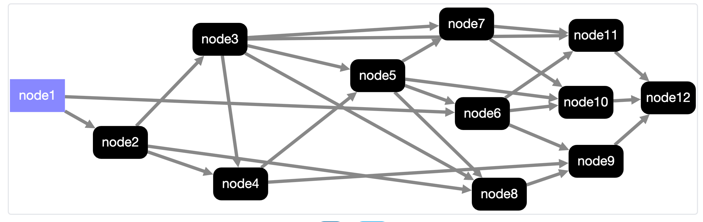

# GraphAI
---

### 📦 GraphAIは魔法のレシピブック！

- コンピューターにいろんな仕事をさせるための特別なレシピブックみたいなものだよ。
- たくさんの小さなロボット（エージェント）たちが協力して働くように指示を出すんだ。それぞれのロボットが得意な仕事を担当するよ。

### ⏱️ なぜ便利なの？

GraphAIを使うと、複雑な仕事も簡単に指示できるんだ。まるで魔法のようにいろんなことが自動的に行われるよ！

---
### 📝 どうやって使うの？

GraphAIの使い方は、こんな感じだよ：

1. やりたいことを考える（例：天気予報を教えて）
2. その仕事を小さな部分に分ける（例：1. 場所を聞く 2. 天気を調べる 3. 結果を伝える）
3. それぞれの部分をGraphAIの「ノード」として書く
4. ノード同士のつながりを矢印で描く
5. 完成したら、GraphAIに任せてみる！

---

## 魔法のレシピブック！GraphData

NodeとEdgeで構成/有向非巡回グラフ

 - 非巡回グラフの動作を繰り返すloop
 - Nested Graphで繰り返し処理 / JSON, YAML, TypeScriptで記述

---

## 🤖Agent(小さなロボット)

TypeScriptで書かれたプログラム

- お天気🌤 / AI / 入力 / データベース
- LLM / RAG / Database / http client / template / echo


---

## GraphData
```TypeScript
{
  version: 0.5
  graph: {
    llm: {
      agent: "openAIAgent"
      params: {system: "foo bar"}
    },
    template: {
      agent: "stringTemplate",
      inputs: {message: ":llm"}
    }
  }
}
```

---
## Agent
```TypeScript
// Params, result, input(array), namedInput(record)
export const dataSumTemplateAgent: AgentFunction<Record<never, never>, number, number> = async ({ inputs }) => {
  return inputs.reduce((tmp, input) => {
    return tmp + input;
  }, 0);
};

const dataSumTemplateAgentInfo: AgentFunctionInfo = {
  name: "dataSumTemplateAgent",
  agent: dataSumTemplateAgent,
  samples: [
    {
      inputs: [1, 2],
      params: {},
      result: 3,
    },
  ],
  description: "Returns the sum of input values",
  category: ["data"],
  author: "Satoshi Nakajima",
  repository: "https://github.com/receptron/graphai",
  license: "MIT",
};
export default dataSumTemplateAgentInfo;


```
---

```TypeScript
import { GraphAI } from "graphai";
import * as agents from "@graphai/agents";

const graphData = {
 ...
};

const main = async () => {
  const graphai = new GraphAI(graphData, agents);
  const result = await graphai.run(true);
  console.log(result);
}

```

---

## npm
- graphai 本体
- @graphai/*_agents
  - 単機能のごとに１つのnpm=agent / 依存関係を減らす目的
  - @graphai/vanilla - npmの依存のないagent
  - @graphai/llm_agents - openAIAgent, groqAgentなどのメタパッケージ
  - @graphai/agents - 全部入りメタパッケージ
- @receptron/* ツール郡
  - graphai_cli, graphai_express, agent_filters

---

## 動作方法 1
 - クライアントのみで動く
   - ブラウザで動作
     - dangerouslyAllowBrowserでopenAIも利用可
     - ollama使って閉じた環境での利用
---

## 動作方法 2
 - サーバのみで動く
   - クライアントからGraphDataをpostする
   - サーバにGraphDataを含む処理を実装
     - 一般的なサーバシステム
 - cliツール
   - コマンドラインで graphai {json_file}
 - バッチ処理
 - Raycastなど、TypeScriptで動くツールに組み込む

---
## 動作方法 3
 - サーバとクライアント連携して動く
   - GraphDataはクライアントで実行
     - Agentは必要に応じでAgentごとにクライアント/サーバで実行
       - サーバで動かす必要のある処理だけサーバで動かす
         - API keyの秘匿性 / データベースへのアクセス / 書き込み
     - Agentがhttpのendpointと対応
---

## サーバクライアント方式
   - 処理の分散
     - サーバは複数サーバ対応
     - 混んでいるサーバを避ける
     - やすいサーバをDynamicに
   - サーバのAgentは必ずしもTypeScriptでなくても良い
     - WebAPIの仕様さえ同じならなんでもok
     - PythonのLLM
     - RAG

---
## AgentFilter
 - 各Agentを実行する前後に処理を挟む
   - expressのmiddleware, Railsのaround filter
   - agentId, nodeId単位で動作の有無を定義
 - 例
   - サーバへ処理をバイパス
   - キャッシュ
   - ログ
   - streaming
---

## Streaming
 - AgentFilterとAgent側の実装
 - httpのstreamingに対応可能
 - いずれの動作方法でも可能
 - 並列で動いている場合も対応

---

## AgentFunctionInfo
- agentの本体と、agentに関する情報
- GraphAIの動作のみならず、様々なツールで利用可能


---

## ユーティリティ
- Agentテスト
  - AgentFunctionInfoを使ってUnit Test
    - TDD
  - Agentのdoc
    - documentの自動生成
  - express serverのmiddleware
    - すぐにサーバ、クライアント構成
---

## Express Server(API)
 - AgentFunctionInfoを元にApiの情報


---

## Future

GraphDataを書き出すAI

- Agentを組み合わせたSubGraphのAgent化
- 世界中のAgentのAPI List
- Agentを検索する仕組み
- Agentを探すAgent
- Agent同士のプロトコルの標準化
- Agentに対する報酬の仕組み
- Agentの信頼性


---
memo

- Agent単体でテストができる（疎結合）
- データの情報をAgentが持つ
  - データ変換の仕組みを用意すれば自動的にagentを結び付けられる
    - Array to string
    - Object to array

---
特徴
 - write once run anywhere
   - ブラウザ、サーバ、組み込み、バッチ、cli
 - no depencendy
   - 本体などは依存するnpmはない
   - vanilla aggentも！
   - 依存があるパッケージは、それぞれ独立
 - 疎結合
   - agent単位でテストができる
 - テストやドキュメントの仕組みを内包する