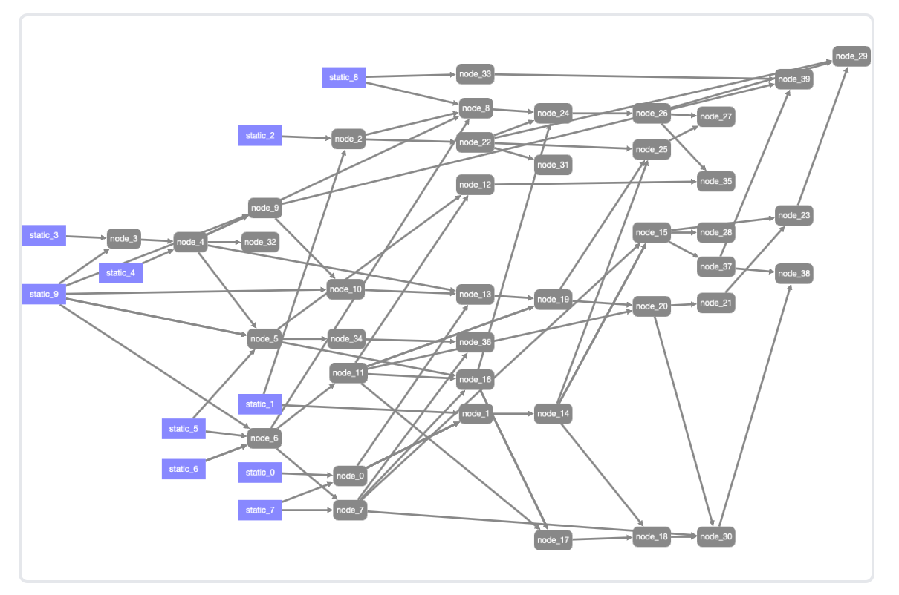
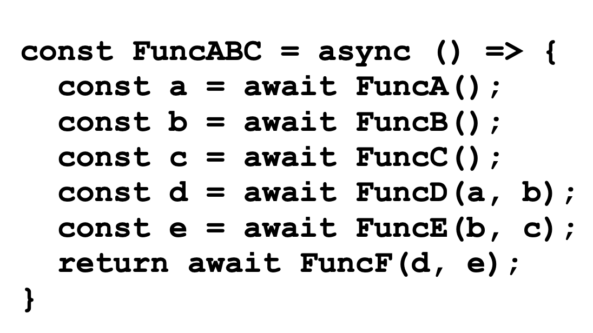

# GraphAI


---
# Multi Agent AI



- AI/Rag/DB/APIを複雑に組み合わせた複合AI
- 実行の順番は？
- 非同期で効率よく動く？
- プログラミング,デバックが大変


---
# 非同期プログラミング問題



- これらの組み合わせだけでも効率良いプログラミングをするのは難しい

---

# 実行時間/実行場所の問題

- １つ１つが20秒かかる場合、４０個組み合わせると１３分かかる
  - 非同期、並列実行は必須
- １つ１つの処理が独立しているほうがよい
   - timeout/実行状況の把握
   - テストしやすい
- クライアント(ブラウザ), サーバで分散させたい
- バッチやAPI化する場合は、全てサーバで動かしたい


---

# GraphAI - データフロープログラミング

- TypeScriptで書かれたデータフロープログラミング

  - Graph=グラフ理論のグラフ（not 円グラフ、棒グラフ)
    - 有向非巡回グラフ
  - Node(Agent)とEdge(矢印=データの流れ)
  - Agentが１つのNodeに対応
    - Agent = LLM/Rag/APIなど実行する１つの関数
    - Agentの動作結果を次のAgentの入力として渡す
---

# GraphAI - TypeScript

- AgentはTypeScript
  - サーバ(Node.js)とブラウザで同じコードがそのまま動く
    - ブラウザで動作、デバックできる
  - Node.jsでPCの開発も可能
  - Agent単体でテスト可能。再利用が容易
- GraphData
  - YAML/JSON 構造化されたデータならなんでもOK

----

# GraphAI - サーバ クライアント

- Agentは、ブラウザやNodeの固有の機能を使わない限りは、ブラウザとNode.jsのどちらでも動く
- Graphをブラウザで実行させ、各Agentを必要に応じてブラウザ、サーバに動的に振り分け可能
  - LLMはAPI KEYが必要なのでサーバ
  - データの単純な処理はブラウザ
  - DBへのアクセスはサーバ
  - Agentの設定をしておけば、Graphを使うユーザはほぼ意識しなくても良い(透過的)

----

# GraphAI - サーバ クライアント

- Agent
  - AgentInfoを整備しておく
- Server
  - GraphAIのサーバ仕様に合わせる
  - Agent一覧を返すAPI + 各Agentを実行するAPI
- 標準化に合わせて実装しておけば、設定いらずで動的な切り替えが可能
- このインタフェースに合わせておけばサーバはPythonなどでもOK
- Streamも対応


----
# GraphAI　- Agent
Agent
```typesctipt
const sampleAgent: AgentFunction = async ({ params, inputs }) => {
  return { params, inputs };
};
```
inputs = 前のNodeの結果を受け取る
param = GraphDataでAgentにわたす値
結果（次のNodeや出力に渡す値）をreturnする


----

# GraphAI - AgentInfo
```typesctipt
const sampleAgentInfo: AgentFunctionInfo = {
  name: "sampleAgent",
  agent: sampleAgent, // agent関数
  samples: [  // DocumentやUnit test用のサンプル
    {
      inputs: sampleInput,
      result: sampleResult,
    },
  ],
  description: "Sample agent",
  category: ["LLM"],
  repository: "https://github.com/isamu/graphai_doc",
};
```
----
# GraphAI - GraphData
```YAML
version: 0.5
nodes:
  echo:
    agent: "echoAgent"
    params:
      message: "echo"
  bypass:
    agent: "bypassAgent"
    inputs: [:echo]
    isResult: true
```
echo nodeでechoというメッセージを作成、bypass nodeがそれを受け取り、結果として出力

----

  # GraphAI アプリケーション例


----

  # GraphAI サンプルと開発ツール

  - Webデモ
    - https://github.com/isamu/graphai-stream-web
    - https://github.com/receptron/graphai-demo-web
  - ブラウザのYAMLエディター
    - https://github.com/receptron/graphai-playground
  - GUIでグラフを作成するツール
    - https://github.com/receptron/graphai-litegraph


----

  # GraphAI Document

- 公式ドキュメント
  - https://github.com/receptron/graphai/blob/main/packages/graphai/README.md
- チュートリアル
  - https://github.com/receptron/graphai/blob/main/docs/Tutorial.md
- zenn
  - https://zenn.dev/topics/graphai
