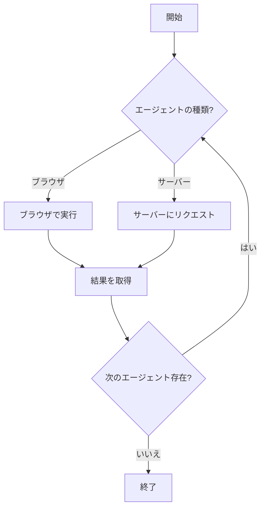

# GraphAIのダイナミックな実行環境切り替えの仕組み

GraphAIは、ブラウザ（クライアント）とサーバー間でエージェントの実行を動的に切り替える革新的な機能を持っています。この仕組みを詳しく見ていきましょう。

## 事前準備

1. **ブラウザ側の準備**
   - ブラウザで実行可能なエージェントを読み込む
   - これにより、クライアント側で処理可能なタスクを特定

2. **サーバー側の情報取得**
   - ブラウザからサーバーにリクエストを送信
   - サーバーで実行可能なエージェントの一覧を取得
   - これにより、サーバー側で処理可能なタスクを把握

## 実行時のプロセス

1. **エージェントの逐次実行**
   - グラフ内の各エージェントを順番に処理
   - 各エージェントの実行環境（ブラウザまたはサーバー）を決定

2. **サーバーエージェントの実行**
   - サーバーで動作するエージェントの場合：
     - 必要なデータ（input, param, namedInputs）をサーバーに送信
     - サーバーからの結果を受け取る
   - この過程は、ブラウザで実行する場合と同じインターフェースで行われる
   - TypeScriptのAgentであれば、サーバ、ブラウザで同じコードで記述できる
   - インターフェースやAgent情報が同じ形式であればサーバはPythonなど他の言語でもよい
   - Agentの再利用が進む
     - データ形式さえ規格として統一すればGraphAI以外の仕組みでも使える

3. **データ形式の一貫性**
   - ブラウザとサーバー間で送受信されるデータの形式は、TypeScript内で渡されるデータの形式と同じ
   - これにより、実行環境の違いを意識せずにワークフローを設計可能

4. **次のエージェントへの移行**
   - 現在のエージェントの処理が完了したら、次のエージェントに移行
   - このプロセスをグラフ内の全エージェントが処理されるまで繰り返す

## 重要なポイント

1. **透過的な実行**: 開発者は実行環境の違いを意識する必要がない
2. **柔軟性**: 同じグラフ内でブラウザとサーバーのエージェントを混在させられる
3. **効率性**: 各エージェントに最適な環境で実行することで、全体のパフォーマンスを向上
4. **スケーラビリティ**: リソース要求の高いタスクをサーバーに委譲可能

この仕組みにより、GraphAIは高度に柔軟で効率的なワークフロー実行を実現しています。実行環境の動的な切り替えは、アプリケーションの性能と拡張性を大幅に向上させる重要な特徴です。
