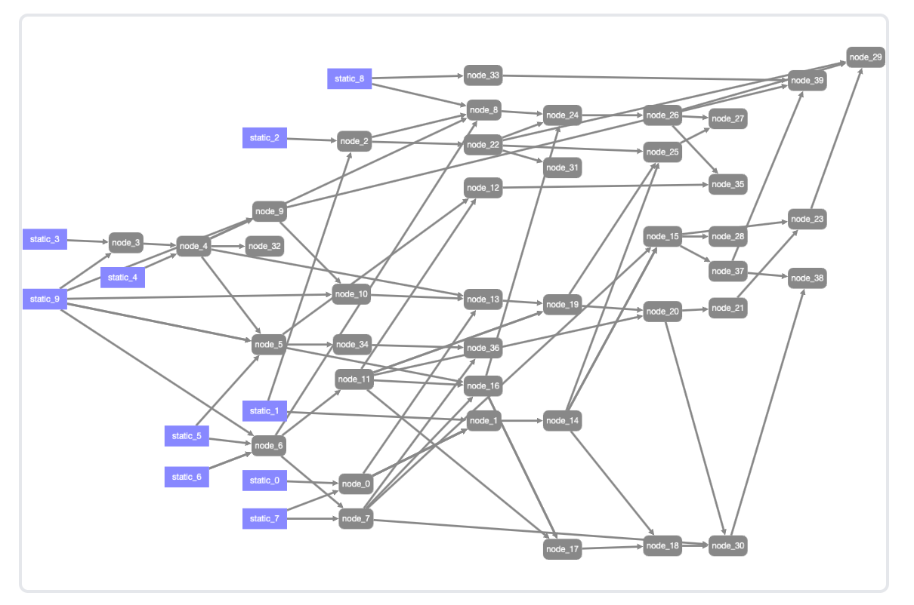
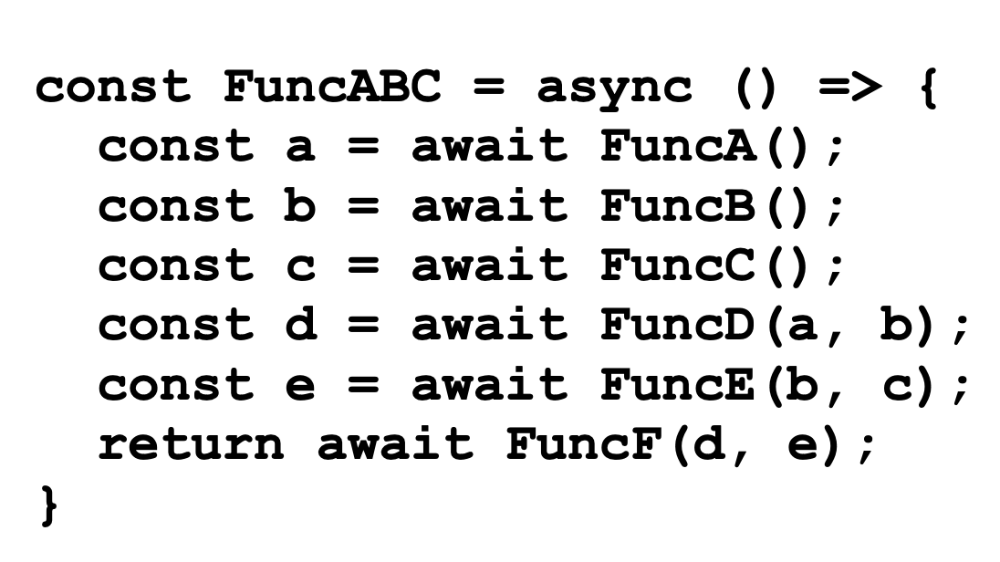

# GraphAI

---
# Multi Agent AI

- AI/Rag/DB/APIを複雑に組み合わせた複合AI
- 実行の順番は？
- 非同期で効率よく動く？
- プログラミング、デバックが大変

---
# 非同期のプログラミング問題

- これらの組み合わせだけでも効率よく動くプログラミングをするのは難しい

---

# 実行時間/実行場所の問題

- １つ１つが20秒かかる場合、４０個組み合わせると１３分かかる
- １つ１つの処理が独立しているほうがよい
   - timeout/実行状況の把握
- クライアント(ブラウザ), サーバで分散させたい
- バッチやAPI化する場合はサーバで動かしたい

---

# GraphAI - データフロープログラミング

- TypeScriptで書かれたデータフロープログラミング

  - Graph=グラフ理論のグラフ（not 円グラフ、棒グラフ)
  - 有向非巡回グラフ
  - Node(Agent)とEdge(矢印=データの流れ)
  - Agentが１つのNode
    - Agent = LLM/Rag/APIなどのプログラミングを実行する関数
    - Agentの動作結果を次のAgentの入力として渡す
---

# GraphAI - TypeScript

- AgentはTypeScript
  - サーバ(Node)とブラウザで同じコードがそのまま動く
    - ブラウザでデバック、開発できる
  - NodeでPCの開発も可能
- GraphData
  - YAML/JSON 構造化されたデータならなんでもOK

----

# GraphAI - サーバ クライアント

- Agentは、ブラウザやNodeの固有の機能を使わない限りは、ブラウザとNode.jsのどちらでも動く
- Graphをブラウザで実行させ、各Agentを必要に応じてブラウザ、サーバに動的に振り分け可能
  - LLMはAPI KEYが必要なのでサーバ
  - データの単純な処理はブラウザ
  - DBへのアクセスはサーバ
  - Agentの設定をしておけば、Graphを使うユーザはほぼ意識しなくても良い(透過的)

----

  # GraphAI アプリケーション例

----

  # GraphAI サンプルと開発ツール

  - Webデモ
    - https://github.com/isamu/graphai-stream-web
    - https://github.com/receptron/graphai-demo-web
  - ブラウザのYAMLエディター
    - https://github.com/receptron/graphai-playground
  - GUIでグラフを作成するツール
    - https://github.com/receptron/graphai-litegraph

----

  # GraphAI Document

- 公式ドキュメント
  - https://github.com/receptron/graphai/blob/main/packages/graphai/README.md
- チュートリアル
  - https://github.com/receptron/graphai/blob/main/docs/Tutorial.md
- zenn
  - https://zenn.dev/topics/graphai
